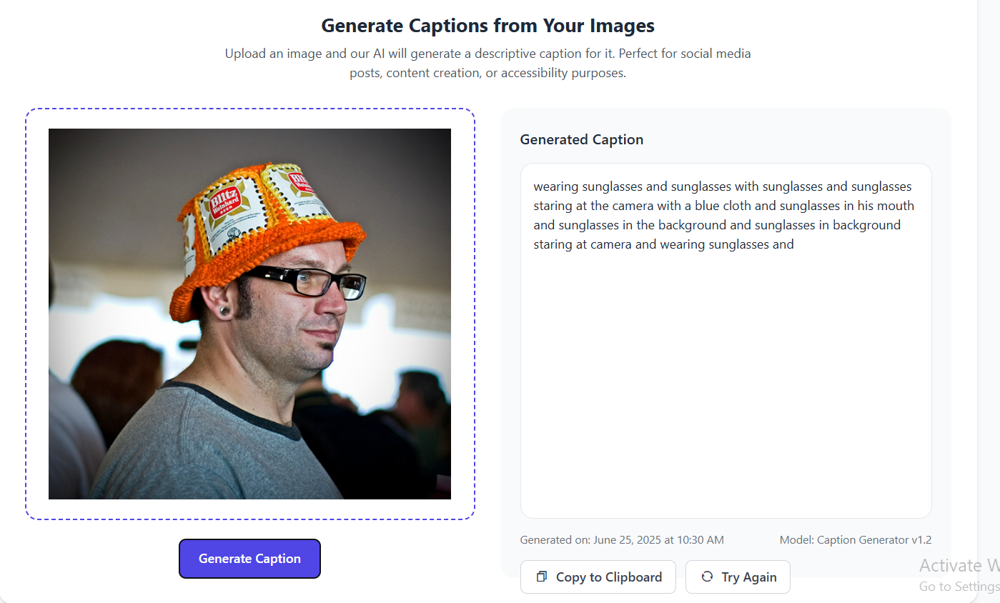

# 🖼️ Image Caption Generator (CNN-LSTM)

## 📚 Project Overview

This project implements an image captioning model using a **Convolutional Neural Network (CNN)** and **Long Short-Term Memory (LSTM)** network.

* **EfficientNetB0** is used for extracting image features.
* **LSTM** generates captions based on those features.
* Trained on the **Flickr8k dataset** — 8,091 images, each with 5 captions.
* Includes:

  * A Jupyter Notebook for training and evaluation
  * A Django web application for serving the model via UI and API

---

## ✨ Key Features

* ✅ EfficientNetB0 for image feature extraction
* ✅ LSTM-based decoder for sequence generation
* ✅ Supports training, inference, and deployment
* ✅ Django web app with UI 

---
---

## 📷 Screenshot

Below is a screenshot of the Image Caption Generator web application in action:




---
## ⚙️ Installation & Setup

### 📦 Prerequisites

* Python 3.10+
* pip
* Git
* Flickr8k dataset (download separately)

---

### 🔧 Setup Instructions

#### 1. Clone the Repository

```bash
git clone https://github.com/Shb987/Caption_Generator.git
cd Caption_Generator
```

#### 2. Set Up Virtual Environment & Install Dependencies

```bash
python -m venv venv

# Activate environment
# On macOS/Linux:
source venv/bin/activate

# On Windows:
venv\Scripts\activate

# Install requirements
pip install -r requirements.txt
```

#### 3. Download the Flickr8k Dataset

* Download from: [Flickr8k Dataset Request Form](https://forms.illinois.edu/sec/1713398)
* Extract and place it in your preferred directory
* Update the `BASE_DIR` variable in the notebook to match your dataset path

#### 4. Prepare the Output Directory

```bash
mkdir outputs
```

* This directory will store:

  * Extracted features
  * Tokenizer
  * Trained model weights

#### 5. Apply Django Migrations

```bash
python manage.py migrate
```

---

## 🚀 How to Run the Server

### 1. Train the Model

Open the training notebook:

```bash
jupyter notebook notebooks/image-caption-generator-using-cnn-lstm.ipynb
```

Steps inside the notebook:

* Preprocess data
* Extract image features
* Train the model
* Save:

  * `outputs/model.h5`
  * `outputs/features.pkl`
  * `outputs/tokenizer.pkl`

---

### 2. Start the Django Server

Ensure the outputs folder contains:

* `model.h5`
* `features.pkl`
* `tokenizer.pkl`

Then run:

```bash
python manage.py runserver
```

Visit: [http://localhost:8000](http://localhost:8000)


## 📌 Notes

* The **Flickr8k dataset** is not included in this repository.
* Use a **GPU** for faster model training and inference.
* This Django server is for **development** purposes. For production, use Gunicorn or deploy to a platform like **Heroku** or **AWS**.
* Ensure the `outputs/` directory contains all required model files before running the server.


